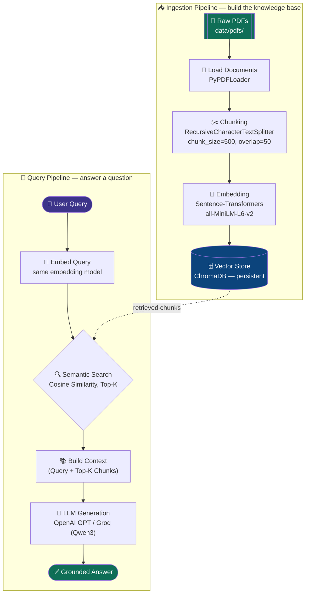

<div align="center">

# 🔎 RAG Pipeline — Retrieval-Augmented Generation from Scratch

**A complete, from-first-principles RAG system** built with LangChain, Sentence-Transformers, and ChromaDB — grounding LLM answers (OpenAI GPT / Groq) in your own PDF documents instead of relying on model memory.

[](https://www.python.org/)
[](https://www.langchain.com/)
[](https://www.trychroma.com/)
[](https://www.sbert.net/)
[](LICENSE)

</div>

---

## 📌 Overview

Large Language Models are powerful, but they hallucinate and their knowledge is frozen at training time. **Retrieval-Augmented Generation (RAG)** fixes this by retrieving relevant chunks of *your* documents at query time and feeding them to the LLM as grounded context — before it generates an answer.

This repo implements the full pipeline **end-to-end, without a high-level RAG framework wrapper** — every stage (ingestion, chunking, embedding, vector storage, retrieval, generation) is built as its own small, inspectable Python class, so you can see exactly what RAG is doing under the hood.

> 📓 Built and documented as part of a hands-on Generative AI / RAG learning project — implementing the pipeline described in the [RAG Survey paper (Gao et al., 2024)](https://arxiv.org/abs/2312.10997), tested by having the system answer questions about the **["Attention Is All You Need"](https://arxiv.org/abs/1706.03762)** transformer paper itself.

---

## 🧠 Why RAG?

| Problem with a plain LLM | How RAG solves it |
|---|---|
| 🌀 **Hallucination** — makes facts up | Answers are grounded in retrieved source text |
| 📅 **Outdated knowledge** — frozen at training cutoff | Swap in fresh documents any time, no retraining |
| ❓ **No source attribution** | Every answer is traceable back to a retrieved chunk |
| 💸 **Fine-tuning is expensive** | Just re-index documents — no GPU training needed |

---

## 🏗️ Architecture

The pipeline has two halves: an **ingestion pipeline** (run once per document set) and a **retrieval + generation pipeline** (run per user query).



---

## ⚙️ Pipeline Breakdown

### 1️⃣ Ingestion Pipeline

| Stage | Component | What it does |
|---|---|---|
| **Load** | `PyPDFLoader` (LangChain) | Reads every PDF in `data/pdfs/`, converts each page into a `Document` object with `page_content` + `metadata` |
| **Chunk** | `RecursiveCharacterTextSplitter` | Splits documents into overlapping ~500-character chunks so context fits within embedding/LLM limits while preserving continuity |
| **Embed** | `EmbeddingManager` → `all-MiniLM-L6-v2` | Converts each text chunk into a 384-dim dense vector capturing semantic meaning |
| **Store** | `VectorStoreManager` → ChromaDB | Persists chunks, embeddings, and metadata in a local, on-disk vector collection |

### 2️⃣ Retrieval Pipeline

| Stage | Component | What it does |
|---|---|---|
| **Query embedding** | `EmbeddingManager` | Encodes the user's question with the *same* embedding model used for ingestion |
| **Semantic search** | `RAGRetriever` → ChromaDB `.query()` | Finds the Top-K most similar chunks by vector distance |
| **Re-rank / score** | Cosine similarity | Converts distance → similarity score, filters by threshold, ranks results |
| **Augmentation** | Prompt template | Injects retrieved chunks as `Context` alongside the original `Query` |
| **Generation** | `ChatOpenAI` / `ChatGroq` | LLM generates the final answer, grounded in the retrieved context |

---

## 📂 Project Structure

```
RAG-Pipeline-LangChain-ChromaDB/
├── 1-RAG_pipeline.ipynb      # Main notebook — full pipeline, step by step
├── data/
│   ├── pdfs/                 # Source PDFs to ingest (place your files here)
│   └── vector_store/         # ChromaDB persistent storage (auto-created)
├── requirements.txt
├── .gitignore
├── LICENSE
└── README.md
```

---

## 🚀 Getting Started

### Prerequisites
- Python 3.10+
- An [OpenAI](https://platform.openai.com/) and/or [Groq](https://console.groq.com/) API key (for the generation step)

### Installation

```bash
# 1. Clone the repo
git clone https://github.com/Harivansh124/RAG-Pipeline-LangChain-ChromaDB.git
cd RAG-Pipeline-LangChain-ChromaDB

# 2. Install dependencies
pip install -r requirements.txt

# 3. Add your PDFs
mkdir -p data/pdfs
# copy your source PDF files into data/pdfs/

# 4. Add your API keys
# open the notebook and set:
#   API_KEY_OPENAI = "your-openai-key"
#   API_Key_GROQ   = "your-groq-key"

# 5. Run the notebook
jupyter notebook 1-RAG_pipeline.ipynb
```

### Usage

```python
# Build the vector index (ingestion)
all_pdf_documents = load_all_pdfs()
chunks = split_docs(all_pdf_documents)

embedding_manager = EmbeddingManager()
vector_store = VectorStoreManager()

texts = [doc.page_content for doc in chunks]
embeddings = embedding_manager.generate_embeddings(texts)
vector_store.add_documents(chunks, embeddings)

# Ask a question (retrieval + generation)
rag_retriever = RAGRetriever(embedding_manager, vector_store)
answer = generate_output("What is an encoder-decoder architecture?", rag_retriever, llm)
print(answer)
```

**Example query on the "Attention Is All You Need" paper:**

> **Q:** *What is encoder-decoder?*
> **A:** *An encoder-decoder is the architecture most competitive sequence transduction models use — the encoder maps an input sequence of symbols to a sequence of continuous representations, and the decoder then generates the output sequence one element at a time, using previously generated symbols as additional input at each step...*

---

## 🛠️ Tech Stack

| Layer | Tool |
|---|---|
| 🧱 Orchestration | LangChain (`langchain-core`, `langchain-community`, `langchain-text-splitters`) |
| 📄 Document loading | `PyPDFLoader` |
| 🔢 Embeddings | `sentence-transformers` (`all-MiniLM-L6-v2`) |
| 🗄️ Vector database | ChromaDB (persistent, local) |
| 📐 Similarity | `scikit-learn` cosine similarity |
| 🤖 LLMs | `langchain-openai` (GPT), `langchain-groq` (Qwen3-32B) |

---

## 🗺️ Roadmap

- [ ] Add re-ranking stage (cross-encoder) for higher retrieval precision
- [ ] Add hybrid search (BM25 + dense retrieval)
- [ ] Streamlit / FastAPI front-end for interactive Q&A
- [ ] Evaluation harness (context relevance, answer faithfulness) using RAGAS

---

## 📚 References

- Vaswani et al., *["Attention Is All You Need"](https://arxiv.org/abs/1706.03762)*, NeurIPS 2017
- Gao et al., *["Retrieval-Augmented Generation for Large Language Models: A Survey"](https://arxiv.org/abs/2312.10997)*, 2024

---

<div align="center">

### 👤 Author

**Harivansh Agrawal**
Aspiring AI/ML Engineer | Deep Learning & GenAI / Prompt Engineering

[](https://github.com/Harivansh124)
[](https://linkedin.com/in/harivansh-agrawal)

⭐ If this project helped you understand RAG, consider giving it a star!

</div>
